# Pobal — Final Codex Build Brief

This file is the authoritative product and engineering source of truth for building **Pobal**, the mobile-web-first network companion application.

The underlying product concept was previously referred to as **Network Companion** in the build brief. For implementation in this repository, treat **Pobal** as the product/application name unless the product owner says otherwise.

---

# Network Companion V1 — Final Codex Build Brief

**Document purpose:** This is the authoritative product, architecture, data model, implementation, testing, deployment, and acceptance brief for building V1 of the Network Companion application.

**Primary instruction to Codex:** Build a production-quality, mobile-web-first SaaS web application, not a prototype. The application must be migration-ready from day one. Local runtime support is required only for development, testing, CI, migration validation, and portability. End users must use a hosted web application.

**Version:** Final V1 build brief  
**Target user:** Management consultant / relationship-driven professional  
**Target state:** Close-to-review-ready V1, suitable for real personal use and later SaaS hardening  
**Future ambition:** V2 commercial product for consultants, advisors, investors, business developers, founders, and other network-dependent professionals

---

## 0. Absolute Build Rules

Codex must follow these rules unless explicitly overridden by the product owner.

### 0.1 Product rules

1. The product is a **mobile-web-first hosted SaaS application**.
2. The product is **not** a local desktop application.
3. The product is **not** a traditional CRM clone.
4. The product is a **relationship companion** that turns meetings, voice notes, and relationship context into structured network intelligence, follow-ups, introductions, and value-creating actions.
5. AI may propose actions and record updates, but AI must not mutate core records without explicit user confirmation.
6. The product must be useful for one user from day one, but must be architected for multi-tenant SaaS expansion.
7. The product must be ready for future Microsoft Outlook / calendar / email integration but must not depend on it for V1 usefulness.
8. LinkedIn must be handled as a manual, user-controlled enrichment source in V1. Do not build scraping, automation, headless browser monitoring, or account navigation.
9. Voice capture is a V1 feature. OpenAI is the default V1 speech-to-text and structuring provider, but the implementation must be provider-agnostic.
10. The product must preserve trust: source links, audit logs, confirmation steps, sensitive-context flags, and explainable suggestions are mandatory.

### 0.2 Engineering rules

1. Build with a **modular monolith** architecture.
2. Use TypeScript end-to-end.
3. Use PostgreSQL as the system of record.
4. Use Prisma for database access and migrations.
5. Use pgvector-compatible embeddings for semantic search.
6. Use Next.js as the application framework.
7. Build a Docker-compatible production runtime.
8. The app must run locally through Docker Compose using local PostgreSQL.
9. No business logic may depend directly on Vercel, Neon, Azure, Stripe, OpenAI, Sentry, or any other vendor SDK.
10. All external services must be accessed through internal provider/adaptor interfaces.
11. All database access must go through repository/service layers with tenant enforcement.
12. Every table containing tenant-owned data must include `tenantId` and must be protected by service-layer tenant checks.
13. The app must pass tenant isolation, RBAC, and audit logging tests before feature work is considered complete.
14. Database migrations must be committed and deployable through `prisma migrate deploy`.
15. No destructive migration may be shipped without an explicit expand/contract plan.
16. All AI outputs that drive application state must be validated against strict JSON schemas.
17. All sensitive operations must write audit logs.
18. The codebase must include test fixtures and seeded demo data.
19. The app must include meaningful empty states, loading states, error states, and retry paths.
20. The final app must be deployable to Vercel/Neon initially and migratable to Azure Container Apps/Azure PostgreSQL later.

---

## 1. Product Vision

### 1.1 Product statement

Network Companion is a mobile-first relationship intelligence application for consultants and other network-dependent professionals. It helps the user capture meetings, voice thoughts, people, companies, commitments, needs, capabilities, and opportunities, then uses AI to propose follow-ups, meeting preparation briefs, introduction opportunities, and relationship actions.

The system is designed around one core observation:

> One person in the user's network may have a problem that another person in the user's network can help solve. The user creates value by noticing, remembering, connecting, and following up at the right time.

### 1.2 Core positioning

Not this:

```text
A CRM where the user documents contacts and activities.
```

But this:

```text
A relationship companion that helps the user create value across a network.
```

### 1.3 Primary V1 goals

V1 must allow the user to:

1. Manage people and linked companies.
2. Document meetings and interactions.
3. Capture voice notes after meetings or during travel.
4. Convert notes and voice dictation into proposed structured updates.
5. Track follow-up tasks and commitments.
6. Identify who needs attention and why now.
7. Identify potential matches between people, needs, capabilities, and companies.
8. Generate meeting preparation briefs.
9. Store LinkedIn URLs and manually provided LinkedIn context without scraping.
10. Prepare for future Microsoft Outlook/calendar/email integration.
11. Operate as a secure, multi-tenant, migration-ready SaaS foundation.

### 1.4 Primary user

The first user is a management consultant who:

- has many meetings;
- uses Microsoft Teams/Copilot summaries;
- currently stores notes in Microsoft Sales or similar CRM tooling;
- needs better follow-up reminders;
- wants to identify problems and solutions across the network;
- wants meeting notes to become actionable network intelligence;
- wants mobile-first capture and review;
- may later commercialise the product.

### 1.5 Secondary future users

V2 may serve:

- consultants;
- partners and business developers;
- investors;
- founders;
- executive search professionals;
- advisors;
- lobbyists/public affairs professionals;
- account managers working in high-trust advisory relationships.

---

## 2. Product Principles

### 2.1 Mobile-first, not desktop-compressed

The mobile app must not be a desktop CRM squeezed into a small screen. The core mobile use cases are:

- capture a thought quickly;
- dictate an update;
- check who to follow up with today;
- prepare for a meeting in five minutes;
- approve AI-proposed record updates;
- search the network semantically;
- review a person before a call.

Desktop is secondary and should support heavier workflows:

- bulk review;
- admin;
- billing;
- exports;
- integration setup;
- deep data editing;
- larger search and network map views.

### 2.2 AI proposes, user confirms

The system may:

- transcribe;
- summarise;
- classify;
- infer likely entities;
- propose tasks;
- propose record updates;
- propose introductions;
- propose meeting briefs;
- explain why a follow-up is relevant.

The system must not:

- update core records without confirmation;
- send messages without confirmation;
- scrape LinkedIn;
- automate LinkedIn activity;
- silently store sensitive inferences as facts;
- make low-confidence entity matches without clarification.

### 2.3 Source-linked intelligence

Every AI-proposed or AI-generated piece of intelligence must be traceable to a source:

- meeting note;
- voice note transcript;
- manually entered note;
- user-provided LinkedIn text;
- future email/calendar source;
- manually created record.

### 2.4 Trust over automation

The application should help the user act better, not act on behalf of the user without control. Trust-building design patterns:

- proposed changes screen;
- approve selected changes;
- edit before applying;
- confidence levels;
- rationale explanations;
- sensitive-context flags;
- audit logs;
- source references;
- undo/archive where feasible.

---

## 3. Strategic Differentiators

V1 must include at least the first three differentiators as real product capabilities. The remaining differentiators should be designed into the data model and partially implemented where feasible.

### 3.1 Relationship brokerage engine — mandatory V1

The app must model and surface links such as:

```text
Person A has a need.
Person B has a relevant capability, experience, access, or solution.
The user may be able to create value through an introduction, insight, or follow-up.
```

Example:

```text
Anna at Siemens is struggling with process ownership.
Michael recently completed a Signavio operating model project.
Suggested action: follow up with Anna and offer to connect her with Michael.
```

Required objects:

- Need
- Capability
- NetworkMatch
- IntroductionSuggestion
- FollowUpTask
- Source reference
- Confidence/rationale

### 3.2 Commitment ledger — mandatory V1

The app must extract and track commitments from meetings, voice notes, and manual notes.

Examples:

- “I will send the benchmark next week.”
- “She will introduce me to the CIO.”
- “We agreed to revisit after budget approval.”
- “He asked for an example of MBSE training.”

Commitments must be distinct from generic tasks.

Commitment properties:

- owner: `ME`, `OTHER_PERSON`, `COMPANY`, `UNKNOWN`
- counterparty person/company
- promised action
- due date or due window
- status
- source
- sensitivity
- next action

### 3.3 Why-now follow-up reasoning — mandatory V1

The app must not only say “follow up”. It must explain why.

Example:

```text
Follow up with Lars because:
- no meaningful interaction for 74 days;
- last meeting discussed PLM ownership;
- you now have a relevant case example from another client;
- there is an open commitment to share a short perspective.
```

Follow-up suggestions must include:

- reason;
- source facts;
- suggested channel;
- suggested timing;
- confidence;
- whether the action is relationship maintenance, opportunity-driven, commitment-driven, milestone-driven, or network-brokerage-driven.

### 3.4 Network objective mode — V1.5-ready, data model in V1

The user should be able to define objectives such as:

- build more relationships in Nordic industrial companies;
- find MBSE training opportunities;
- strengthen cybersecurity advisory network in Germany;
- develop access to energy sector executives.

V1 should include a simple data model and basic UI for network objectives if feasible. Full optimisation can be V1.5.

### 3.5 Reciprocity tracker — V1.5-ready

The app should track relationship balance:

- I helped them;
- they helped me;
- I asked for something;
- they asked for something;
- introduction given;
- introduction received.

The point is to support trust, not gamification.

### 3.6 Sensitive-context memory — mandatory baseline in V1

The app must allow information to be flagged as:

- normal business note;
- sensitive business note;
- personal milestone;
- confidential topic;
- do-not-use-in-outreach note;
- do-not-share note.

Sensitive context must never be reused blindly in generated messages or recommendations.

### 3.7 Dedicated introduction workflow — basic V1, richer V1.5

The app must support introduction suggestions in V1 and should include a basic workflow:

1. AI suggests potential introduction.
2. User reviews rationale.
3. User marks suggestion as accepted, rejected, parked, or completed.
4. App can draft opt-in messages but does not send automatically.
5. App tracks status and outcome.

---

## 4. V1 Scope

### 4.1 In scope

- Mobile-first SaaS web application.
- Authentication and tenant model.
- People and companies.
- Meeting documentation.
- Manual meeting note ingestion.
- Voice capture / speak-to-update.
- AI structured extraction.
- AI proposal review workflow.
- Follow-up tasks.
- Commitment ledger.
- Relationship brokerage engine.
- Why-now follow-up reasoning.
- Meeting preparation briefs.
- Semantic search.
- Manual LinkedIn enrichment.
- Microsoft integration readiness.
- Billing foundation.
- Audit log.
- Data export and deletion foundation.
- Admin/settings foundation.
- Demo data.
- CI/CD, Docker, tests, migration-readiness.

### 4.2 Out of scope for V1

- Automated LinkedIn scraping.
- Browser extensions that scrape LinkedIn.
- Headless browser agents navigating LinkedIn.
- Automated LinkedIn connection/message/comment/like activity.
- Fully autonomous email sending.
- Full sales pipeline CRM.
- Mass email campaigns.
- Complex team collaboration workflows.
- Native iOS/Android apps.
- Offline-first local app.
- Complex graph visualisation beyond simple relationship/match views.
- Enterprise SSO beyond Microsoft OAuth-ready structure.
- Production-grade SOC 2 certification work.

---

## 5. Target Architecture

### 5.1 Architectural style

Use a **modular monolith**.

Rationale:

- Faster to build than microservices.
- Easier for Codex to maintain coherently.
- Strong enough for V1 and early SaaS.
- Can be decomposed later if scale demands it.
- Allows strict internal boundaries without distributed-system complexity.

### 5.2 Default V1 deployment

```text
Vercel
+ Neon PostgreSQL
+ Inngest or equivalent job provider
+ S3-compatible object storage
+ OpenAI
+ Stripe
+ Sentry
```

### 5.3 Migration-ready Azure target

```text
Azure Container Apps
+ Azure Database for PostgreSQL Flexible Server
+ Azure Blob Storage
+ Azure Key Vault
+ Azure Monitor / Application Insights
+ Microsoft Entra ID
+ OpenAI or Azure OpenAI / Azure Speech optional
+ Stripe or future enterprise billing
```

### 5.4 Portability mandate

The application must be deployable in both modes:

1. **Managed SaaS velocity mode:** Vercel/Neon.
2. **Enterprise cloud mode:** Azure Container Apps/Azure PostgreSQL.

### 5.5 High-level architecture

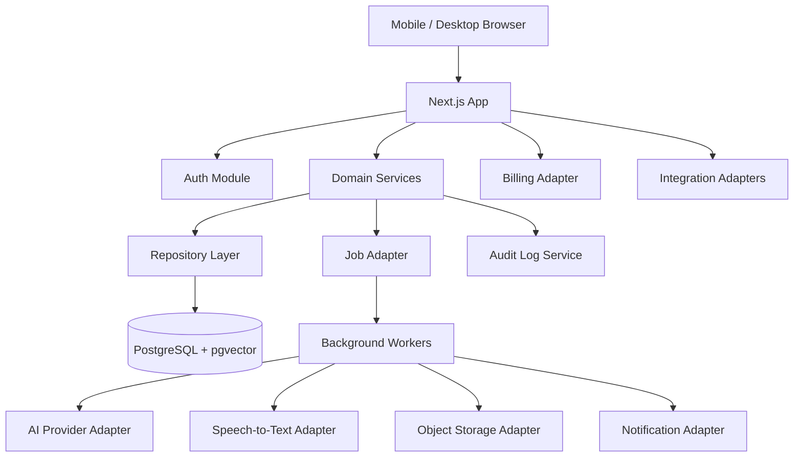

### 5.6 Deployment topology — V1

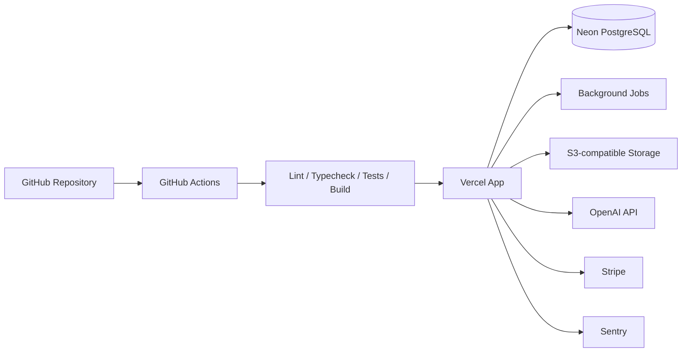

### 5.7 Deployment topology — Azure migration target

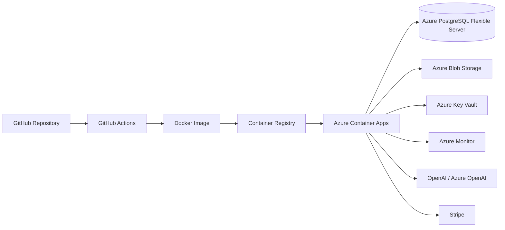

### 5.8 Internal module architecture

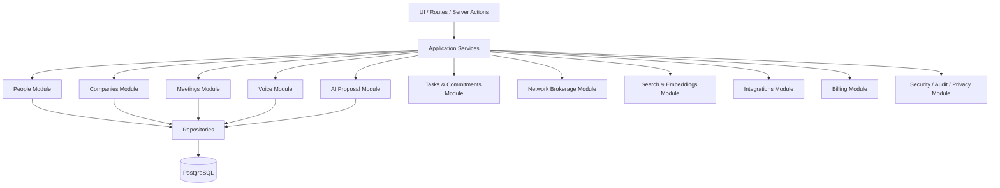

---

## 6. Recommended Technology Stack

### 6.1 Application

- Framework: Next.js App Router
- Language: TypeScript
- UI: React
- Styling: Tailwind CSS
- UI components: shadcn/ui
- Forms: React Hook Form + Zod
- Validation: Zod
- ORM: Prisma
- Database: PostgreSQL
- Semantic search: pgvector-compatible embeddings
- Charts/visuals if needed: Recharts
- Testing: Vitest, Playwright, Testing Library

### 6.2 Authentication

- Auth.js / NextAuth-compatible architecture
- Default V1 login:
  - Microsoft OAuth / Microsoft Entra ID
  - magic-link email optional
- Must include `AUTH_SECRET` or equivalent secret management.
- Must support future enterprise SSO.

### 6.3 AI

- Default V1 AI provider: OpenAI.
- Default speech-to-text provider: OpenAI.
- Use provider abstraction for future Azure OpenAI, Azure Speech, or private deployments.
- All AI outputs that drive state must use strict structured output schemas.

### 6.4 Background jobs

Use job adapter pattern.

Default V1 provider options:

- Inngest, Trigger.dev, or similar.

Future Azure options:

- Azure Container Apps Jobs;
- Azure Functions;
- hosted worker container.

Jobs must support:

- AI processing;
- voice transcription;
- embedding generation;
- reminder checks;
- notification dispatch;
- future Microsoft sync;
- cleanup/retention jobs.

### 6.5 Storage

Use storage adapter pattern.

V1:

- S3-compatible object storage or Vercel Blob if abstracted.

Azure target:

- Azure Blob Storage.

Storage use cases:

- temporary audio files;
- export files;
- optional attachments;
- generated reports if added later.

### 6.6 Billing

Use billing adapter pattern.

V1:

- Stripe Billing foundation.

Must support:

- free/internal workspace;
- paid subscription placeholder;
- trial status;
- billing status;
- future usage limits.

### 6.7 Monitoring

V1:

- Sentry for error monitoring.
- Structured logs.

Azure target:

- Azure Monitor / Application Insights optional.

---

## 7. Repository Structure

Implement a clear folder structure similar to:

```text
/network-companion
  /app
    /(auth)
    /(mobile)
    /(desktop)
    /api
    /admin
  /components
    /ui
    /mobile
    /desktop
    /forms
    /cards
    /states
  /domains
    /auth
    /tenancy
    /people
    /companies
    /meetings
    /voice
    /ai-proposals
    /tasks
    /commitments
    /brokerage
    /search
    /linkedin
    /microsoft
    /billing
    /notifications
    /audit
    /privacy
  /lib
    /db
    /validation
    /auth
    /errors
    /logging
    /feature-flags
    /config
  /providers
    /ai
    /speech-to-text
    /storage
    /jobs
    /email
    /billing
    /telemetry
    /microsoft-graph
  /prisma
    schema.prisma
    /migrations
    seed.ts
  /tests
    /unit
    /integration
    /e2e
    /fixtures
    /ai-evals
  /docs
    architecture.md
    data-model.md
    deployment.md
    azure-migration.md
    security.md
    ai-contracts.md
  docker-compose.yml
  Dockerfile
  .env.example
  README.md
```

---

## 8. Core Data Model

### 8.1 Data model principles

1. Use UUID primary keys.
2. Use `tenantId` on all tenant-owned records.
3. Include `createdAt`, `updatedAt`, and where relevant `deletedAt`.
4. Use soft deletion for important business records.
5. Use audit logs for sensitive mutations.
6. Use source references for AI-generated insights.
7. Keep raw notes/transcripts separate from structured extracted objects.
8. Store AI confidence and rationale where decisions are suggested.
9. Use many-to-many linking tables where relationships are not one-dimensional.
10. Model needs and capabilities as first-class objects.

### 8.2 Entity overview

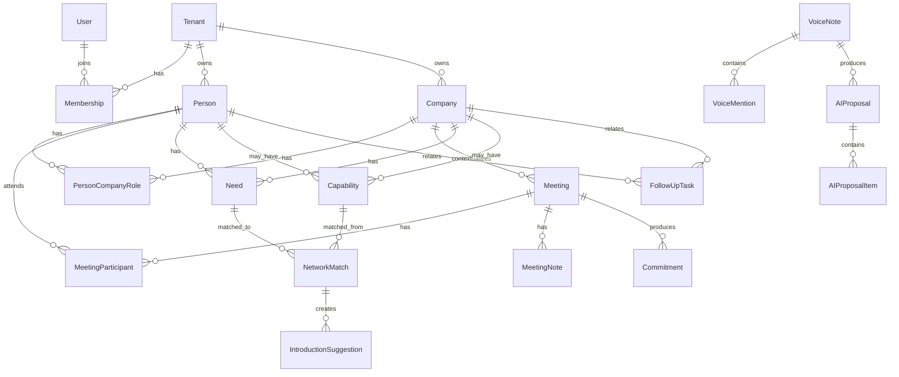

### 8.3 Required models

#### Tenant

Represents a workspace/account.

Fields:

- id
- name
- slug
- plan
- billingCustomerId nullable
- billingSubscriptionId nullable
- billingStatus
- createdAt
- updatedAt

#### User

Represents an authenticated human user.

Fields:

- id
- email
- name
- imageUrl nullable
- defaultTenantId nullable
- createdAt
- updatedAt

#### Membership

Links users to tenants.

Fields:

- id
- tenantId
- userId
- role: `OWNER | ADMIN | MEMBER | VIEWER`
- status: `ACTIVE | INVITED | DISABLED`
- createdAt
- updatedAt

#### Company

Fields:

- id
- tenantId
- name
- website nullable
- domain nullable
- industry nullable
- geography nullable
- description nullable
- strategicRelevance: `LOW | MEDIUM | HIGH | CRITICAL` nullable
- relationshipStatus: `UNKNOWN | TARGET | ACTIVE | DORMANT | FORMER | DO_NOT_CONTACT`
- source
- createdAt
- updatedAt
- deletedAt nullable

#### Person

Fields:

- id
- tenantId
- firstName
- lastName
- fullName
- primaryEmail nullable
- phone nullable
- title nullable
- seniority nullable
- location nullable
- bio nullable
- linkedinUrl nullable
- relationshipStatus: `UNKNOWN | ACTIVE | DORMANT | STRATEGIC | DO_NOT_CONTACT`
- relationshipTemperature: `UNKNOWN | COLD | WARM | STRONG | AT_RISK`
- strategicRelevance: `LOW | MEDIUM | HIGH | CRITICAL` nullable
- lastMeaningfulInteractionAt nullable
- nextSuggestedFollowUpAt nullable
- source
- createdAt
- updatedAt
- deletedAt nullable

#### PersonCompanyRole

Tracks one person across one or more companies and historical roles.

Fields:

- id
- tenantId
- personId
- companyId
- title nullable
- department nullable
- startDate nullable
- endDate nullable
- isCurrent
- source
- createdAt
- updatedAt

#### Meeting

Fields:

- id
- tenantId
- title
- meetingDate
- startTime nullable
- endTime nullable
- location nullable
- meetingType: `IN_PERSON | TEAMS | PHONE | OTHER`
- primaryCompanyId nullable
- summary nullable
- outcome nullable
- source: `MANUAL | TEAMS_COPILOT_PASTE | VOICE | FUTURE_GRAPH`
- status: `DRAFT | CAPTURED | STRUCTURED | REVIEWED | ARCHIVED`
- createdByUserId
- createdAt
- updatedAt
- deletedAt nullable

#### MeetingParticipant

Fields:

- id
- tenantId
- meetingId
- personId nullable
- displayName
- email nullable
- companyId nullable
- roleInMeeting nullable
- isInternal
- createdAt
- updatedAt

#### MeetingNote

Stores raw and cleaned meeting notes.

Fields:

- id
- tenantId
- meetingId
- noteType: `RAW | CLEANED | USER_SUMMARY | AI_SUMMARY`
- content
- source
- createdByUserId nullable
- createdAt
- updatedAt

#### Interaction

General relationship interaction record.

Fields:

- id
- tenantId
- interactionType: `MEETING | CALL | EMAIL | LINKEDIN_MANUAL | VOICE_NOTE | MANUAL_NOTE | INTRODUCTION`
- occurredAt
- personId nullable
- companyId nullable
- meetingId nullable
- title nullable
- summary nullable
- source
- createdAt
- updatedAt

#### Need

A problem, pain point, objective, requirement, or interest.

Fields:

- id
- tenantId
- title
- description
- needType: `PROBLEM | OBJECTIVE | BUYING_SIGNAL | INTEREST | RISK | QUESTION | UNKNOWN`
- personId nullable
- companyId nullable
- meetingId nullable
- priority: `LOW | MEDIUM | HIGH | CRITICAL`
- status: `OPEN | IN_PROGRESS | ADDRESSED | PARKED | CLOSED`
- sensitivity: `NORMAL | SENSITIVE_BUSINESS | CONFIDENTIAL | DO_NOT_SHARE`
- sourceType
- sourceId nullable
- confidence nullable
- createdAt
- updatedAt

#### Capability

A capability, solution, expertise, access, experience, or relevant asset.

Fields:

- id
- tenantId
- title
- description
- capabilityType: `EXPERTISE | SOLUTION | ACCESS | EXPERIENCE | PRODUCT | CASE_STUDY | RELATIONSHIP | OTHER`
- personId nullable
- companyId nullable
- confidence nullable
- sourceType
- sourceId nullable
- createdAt
- updatedAt

#### NetworkMatch

Suggested match between a need and a capability/person/company.

Fields:

- id
- tenantId
- needId
- capabilityId nullable
- suggestedPersonId nullable
- suggestedCompanyId nullable
- matchType: `PERSON_CAN_HELP | COMPANY_CAN_HELP | INTRODUCTION | INSIGHT_TO_SHARE | CASE_TO_SHARE`
- rationale
- confidence
- status: `PROPOSED | ACCEPTED | REJECTED | PARKED | ACTIONED`
- createdBy: `AI | USER`
- createdAt
- updatedAt

#### IntroductionSuggestion

Fields:

- id
- tenantId
- networkMatchId nullable
- fromPersonId nullable
- toPersonId nullable
- relatedNeedId nullable
- relatedCapabilityId nullable
- rationale
- status: `PROPOSED | ACCEPTED | OPT_IN_REQUESTED | INTRO_SENT | COMPLETED | REJECTED | PARKED`
- draftMessageA nullable
- draftMessageB nullable
- draftIntroMessage nullable
- createdAt
- updatedAt

#### FollowUpTask

Fields:

- id
- tenantId
- title
- description nullable
- dueAt nullable
- reminderAt nullable
- status: `OPEN | SNOOZED | DONE | CANCELLED`
- priority: `LOW | MEDIUM | HIGH | CRITICAL`
- taskType: `FOLLOW_UP | COMMITMENT | INTRODUCTION | MEETING_PREP | RELATIONSHIP_MAINTENANCE | OTHER`
- personId nullable
- companyId nullable
- meetingId nullable
- commitmentId nullable
- networkMatchId nullable
- whyNowRationale nullable
- sourceType
- sourceId nullable
- createdBy: `AI | USER`
- createdAt
- updatedAt

#### Commitment

Fields:

- id
- tenantId
- ownerType: `ME | OTHER_PERSON | COMPANY | UNKNOWN`
- ownerPersonId nullable
- counterpartyPersonId nullable
- counterpartyCompanyId nullable
- title
- description nullable
- dueAt nullable
- dueWindow nullable
- status: `OPEN | WAITING | DONE | CANCELLED | OVERDUE`
- sensitivity: `NORMAL | SENSITIVE_BUSINESS | CONFIDENTIAL`
- sourceType
- sourceId nullable
- meetingId nullable
- createdAt
- updatedAt

#### Milestone

Fields:

- id
- tenantId
- personId nullable
- companyId nullable
- milestoneType: `ROLE_CHANGE | COMPANY_CHANGE | PERSONAL | PROJECT | PUBLIC_NEWS | OTHER`
- title
- description nullable
- date nullable
- sensitivity: `NORMAL | PERSONAL | SENSITIVE | DO_NOT_USE_IN_OUTREACH`
- sourceType
- sourceId nullable
- createdAt
- updatedAt

#### VoiceNote

Fields:

- id
- tenantId
- createdByUserId
- sourceContextType: `GENERAL | PERSON | COMPANY | MEETING | TASK`
- sourceContextId nullable
- transcriptText nullable
- transcriptLanguage nullable
- transcriptConfidence nullable
- audioObjectKey nullable
- audioDurationSeconds nullable
- audioMimeType nullable
- audioRetentionPolicy: `DELETE_IMMEDIATELY | RETAIN_7_DAYS | RETAIN_UNTIL_USER_DELETE`
- status: `RECORDED | UPLOADED | TRANSCRIBED | STRUCTURED | NEEDS_CLARIFICATION | PROPOSED | APPLIED | REJECTED | FAILED`
- errorMessage nullable
- createdAt
- updatedAt

#### VoiceMention

Fields:

- id
- tenantId
- voiceNoteId
- mentionType: `PERSON | COMPANY | NEED | CAPABILITY | TASK | MEETING | OPPORTUNITY | INTRODUCTION | COMMITMENT | MILESTONE`
- rawText
- resolvedEntityType nullable
- resolvedEntityId nullable
- confidence
- requiresUserConfirmation
- createdAt

#### AIProposal

A proposal generated by AI. It can come from meeting notes, voice notes, LinkedIn manual text, future email imports, or scheduled analysis.

Fields:

- id
- tenantId
- proposalType: `MEETING_EXTRACTION | VOICE_UPDATE | FOLLOW_UP | NETWORK_MATCH | MEETING_PREP | LINKEDIN_MANUAL_ENRICHMENT | EMAIL_EXTRACTION`
- sourceType
- sourceId nullable
- title
- summary nullable
- status: `PENDING | PARTIALLY_APPROVED | APPROVED | REJECTED | APPLIED | FAILED`
- confidence nullable
- createdBy: `AI | USER`
- reviewedByUserId nullable
- reviewedAt nullable
- appliedAt nullable
- createdAt
- updatedAt

#### AIProposalItem

Fields:

- id
- tenantId
- aiProposalId
- itemType: `CREATE | UPDATE | LINK | DELETE | CREATE_TASK | CREATE_NEED | CREATE_CAPABILITY | CREATE_COMMITMENT | CREATE_MATCH | CREATE_INTRODUCTION | ADD_NOTE | ADD_MILESTONE`
- targetEntityType nullable
- targetEntityId nullable
- proposedPatchJson
- userVisibleExplanation
- confidence
- status: `PENDING | APPROVED | EDITED | REJECTED | APPLIED | FAILED`
- createdAt
- updatedAt

#### LinkedInManualContext

V1 compliant LinkedIn storage. No scraping.

Fields:

- id
- tenantId
- personId nullable
- companyId nullable
- linkedinUrl
- pastedText nullable
- userSummary nullable
- capturedAt
- source: `USER_PASTED | USER_SUMMARISED | LINKEDIN_EXPORT_UPLOAD`
- status: `RAW | STRUCTURED | ARCHIVED`
- createdAt
- updatedAt

#### SemanticDocument

A chunk/indexable item for semantic search.

Fields:

- id
- tenantId
- sourceType
- sourceId
- title nullable
- content
- contentHash
- embedding vector nullable
- embeddingModel nullable
- createdAt
- updatedAt

#### AuditLog

Fields:

- id
- tenantId
- actorUserId nullable
- action
- entityType
- entityId nullable
- beforeJson nullable
- afterJson nullable
- metadataJson nullable
- ipAddress nullable
- userAgent nullable
- createdAt

#### Notification

Fields:

- id
- tenantId
- userId
- notificationType
- title
- body nullable
- status: `PENDING | SENT | READ | DISMISSED | FAILED`
- deliveryChannel: `IN_APP | EMAIL | PUSH_FUTURE`
- scheduledFor nullable
- sentAt nullable
- createdAt

#### MicrosoftIntegrationAccount

Future-ready Microsoft Graph integration.

Fields:

- id
- tenantId
- userId
- provider: `MICROSOFT_GRAPH`
- externalAccountId
- email
- accessTokenEncrypted nullable
- refreshTokenEncrypted nullable
- scopes
- status: `CONNECTED | EXPIRED | REVOKED | ERROR`
- lastSyncAt nullable
- deltaTokenEncrypted nullable
- createdAt
- updatedAt

#### NetworkObjective

Fields:

- id
- tenantId
- title
- description nullable
- status: `ACTIVE | PARKED | COMPLETED | ARCHIVED`
- priority: `LOW | MEDIUM | HIGH | CRITICAL`
- targetIndustriesJson nullable
- targetGeographiesJson nullable
- targetCapabilitiesJson nullable
- createdAt
- updatedAt

#### ReciprocityEvent

Fields:

- id
- tenantId
- personId nullable
- companyId nullable
- eventType: `I_HELPED_THEM | THEY_HELPED_ME | I_ASKED | THEY_ASKED | INTRO_GIVEN | INTRO_RECEIVED | VALUE_SHARED`
- title
- description nullable
- occurredAt
- sourceType nullable
- sourceId nullable
- createdAt

---

## 9. Prisma Schema Skeleton

Codex must create a complete Prisma schema. The following is a structural guide, not the only allowed implementation. Ensure all tenant-owned models include tenant isolation.

```prisma
model Tenant {
  id        String   @id @default(uuid())
  name      String
  slug      String   @unique
  plan      String   @default("INTERNAL")
  billingCustomerId     String?
  billingSubscriptionId String?
  billingStatus         String? @default("NONE")
  createdAt DateTime @default(now())
  updatedAt DateTime @updatedAt

  memberships Membership[]
  people      Person[]
  companies   Company[]
}

model User {
  id        String   @id @default(uuid())
  email     String   @unique
  name      String?
  imageUrl  String?
  defaultTenantId String?
  createdAt DateTime @default(now())
  updatedAt DateTime @updatedAt

  memberships Membership[]
}

model Membership {
  id        String   @id @default(uuid())
  tenantId  String
  userId    String
  role      String
  status    String   @default("ACTIVE")
  createdAt DateTime @default(now())
  updatedAt DateTime @updatedAt

  tenant Tenant @relation(fields: [tenantId], references: [id])
  user   User   @relation(fields: [userId], references: [id])

  @@unique([tenantId, userId])
  @@index([tenantId])
  @@index([userId])
}

model Company {
  id        String   @id @default(uuid())
  tenantId  String
  name      String
  website   String?
  domain    String?
  industry  String?
  geography String?
  description String?
  strategicRelevance String?
  relationshipStatus String @default("UNKNOWN")
  source    String?
  createdAt DateTime @default(now())
  updatedAt DateTime @updatedAt
  deletedAt DateTime?

  tenant Tenant @relation(fields: [tenantId], references: [id])
  roles  PersonCompanyRole[]

  @@index([tenantId])
  @@index([tenantId, name])
}

model Person {
  id        String   @id @default(uuid())
  tenantId  String
  firstName String?
  lastName  String?
  fullName  String
  primaryEmail String?
  phone     String?
  title     String?
  seniority String?
  location  String?
  bio       String?
  linkedinUrl String?
  relationshipStatus String @default("UNKNOWN")
  relationshipTemperature String @default("UNKNOWN")
  strategicRelevance String?
  lastMeaningfulInteractionAt DateTime?
  nextSuggestedFollowUpAt DateTime?
  source    String?
  createdAt DateTime @default(now())
  updatedAt DateTime @updatedAt
  deletedAt DateTime?

  tenant Tenant @relation(fields: [tenantId], references: [id])
  roles  PersonCompanyRole[]

  @@index([tenantId])
  @@index([tenantId, fullName])
  @@index([tenantId, primaryEmail])
}

model PersonCompanyRole {
  id        String   @id @default(uuid())
  tenantId  String
  personId  String
  companyId String
  title     String?
  department String?
  startDate DateTime?
  endDate   DateTime?
  isCurrent Boolean @default(true)
  source    String?
  createdAt DateTime @default(now())
  updatedAt DateTime @updatedAt

  person  Person  @relation(fields: [personId], references: [id])
  company Company @relation(fields: [companyId], references: [id])

  @@index([tenantId])
  @@index([tenantId, personId])
  @@index([tenantId, companyId])
}
```

Continue the schema for all models listed in Section 8.3.

---

## 10. Mobile-First UX

### 10.1 Primary navigation

Mobile bottom navigation must contain:

```text
Today | Capture | People | Opportunities | Search
```

### 10.2 Mobile screen inventory

#### Today

Purpose: Daily command centre.

Must show:

- today’s meetings;
- follow-ups due today;
- overdue commitments;
- stale high-value relationships;
- AI proposals requiring approval;
- suggested introductions;
- why-now recommendations;
- voice notes awaiting review.

Primary actions:

- start voice capture;
- create quick follow-up;
- approve AI proposal;
- open meeting prep;
- snooze task;
- mark done.

#### Capture

Purpose: Fastest place to add new intelligence.

Must support:

- voice note;
- paste Teams/Copilot meeting notes;
- manual meeting note;
- quick person;
- quick company;
- quick task;
- quick need/capability.

#### People

Purpose: Relationship system of record.

Must support:

- list/search people;
- relationship temperature;
- last interaction;
- next follow-up;
- linked company;
- open commitments;
- needs/capabilities;
- introduction history;
- LinkedIn URL/manual context.

#### Opportunities

Purpose: Network brokerage.

Must show:

- open needs;
- relevant capabilities;
- proposed matches;
- proposed introductions;
- network objectives;
- parked suggestions.

#### Search

Purpose: Semantic and structured search.

Must support queries like:

- “Who knows Signavio?”
- “Who has PLM challenges?”
- “What did Anna say about process ownership?”
- “People in energy sector I have not spoken to recently”
- “Open commitments around MBSE training”

### 10.3 Desktop screen inventory

Desktop must include all mobile features plus:

- admin/settings;
- billing;
- integration setup;
- export/delete;
- data management;
- bulk AI proposal review;
- larger meeting and company views;
- demo data reset if in development/demo environment.

### 10.4 UI principles

- Bottom navigation on mobile.
- Large tap targets.
- One primary action per screen.
- Cards over dense tables.
- Progressive disclosure.
- Clear confidence labels.
- Plain language explanations.
- No hidden AI mutations.
- Empty states must teach the user what to do next.

---

### 10.5 Required route map

Codex must create clear routes. Exact folder structure may follow Next.js App Router conventions, but the product routes must map to the following user-facing areas.

```text
/                         -> redirect to /today when authenticated
/login                    -> authentication
/onboarding               -> initial tenant/workspace setup
/today                    -> mobile-first daily command centre
/capture                  -> capture hub
/capture/voice            -> voice capture workflow
/capture/meeting          -> paste meeting notes
/people                   -> people list/search
/people/new               -> create person
/people/[personId]        -> person detail
/companies                -> companies list/search
/companies/new            -> create company
/companies/[companyId]    -> company detail
/meetings                 -> meetings list
/meetings/new             -> create meeting
/meetings/[meetingId]     -> meeting detail and notes
/opportunities            -> needs, capabilities, matches, introductions
/opportunities/needs/[id] -> need detail
/opportunities/matches/[id] -> network match detail
/search                   -> global and semantic search
/proposals                -> AI proposal inbox
/proposals/[proposalId]   -> proposal review and approval
/tasks                    -> task and commitment list
/settings                 -> user/workspace settings
/settings/billing         -> billing foundation
/settings/integrations    -> Microsoft/LinkedIn/manual integration settings
/settings/privacy         -> export/delete/privacy controls
/admin                    -> admin-only workspace overview
```

Mobile navigation must prioritise `/today`, `/capture`, `/people`, `/opportunities`, and `/search`. Other routes can be reached through contextual links or settings menus.

### 10.6 Mobile-web and PWA requirements

The application must be mobile-web-first and should be PWA-ready.

Required:

- responsive layout starting from approximately 360px viewport width;
- touch-friendly controls;
- mobile bottom navigation;
- installable web app manifest if feasible;
- sensible mobile browser metadata;
- safe-area handling for modern phones;
- loading skeletons for AI-heavy screens;
- no desktop-only critical workflow;
- voice capture available from mobile browser where microphone permission is granted.

Optional for V1, but architecturally allowed:

- push notifications;
- offline draft capture;
- home-screen install prompt;
- background sync.

Do not implement offline-first complexity in V1 unless the core application is already stable.

## 11. Feature Specifications and Flow Diagrams

### 11.1 Workspace, authentication, users, roles, billing

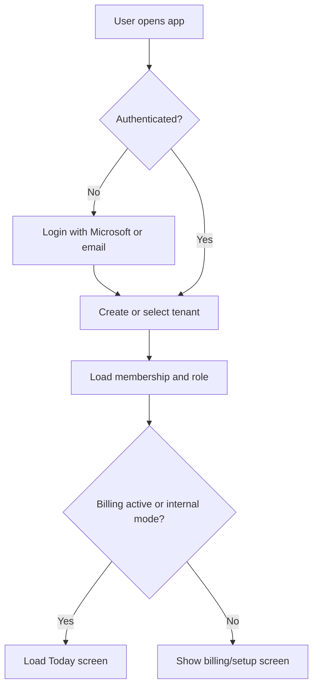

Acceptance criteria:

- User can sign in.
- User belongs to a tenant.
- Role is enforced.
- Tenant data is isolated.
- Audit log records sensitive admin actions.
- Billing status exists even if payments are not active for internal V1.

### 11.2 People and companies

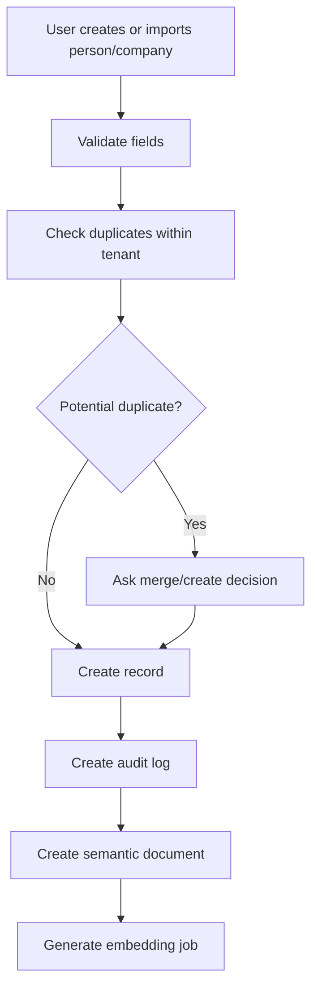

Acceptance criteria:

- Create/edit/archive person.
- Create/edit/archive company.
- Link person to company.
- Support current and historical roles.
- Store LinkedIn URL.
- Display last interaction and relationship temperature.

### 11.3 Meeting documentation

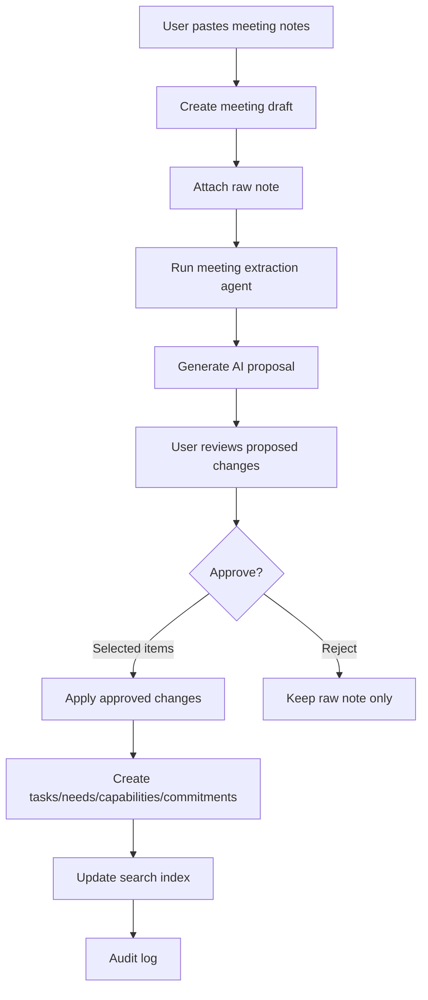

Acceptance criteria:

- User can paste Teams/Copilot notes.
- AI extracts participants, topics, needs, capabilities, commitments, tasks, milestones, sensitive flags.
- User can approve selected items.
- Applied changes are source-linked.

### 11.4 Speak-to-update

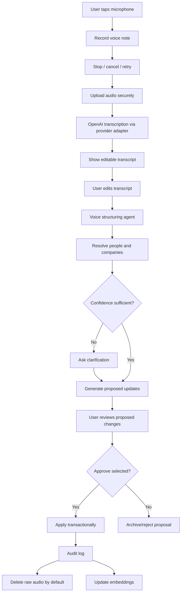

Acceptance criteria:

- User can record voice note from mobile browser.
- User can cancel/retry.
- Audio transcribes using OpenAI provider by default.
- Transcript is editable before structuring.
- AI proposes structured updates.
- User approval is required before mutation.
- Raw audio is deleted by default after successful transcription.
- Transcript and applied changes keep source linkage.

### 11.5 AI proposal review workflow

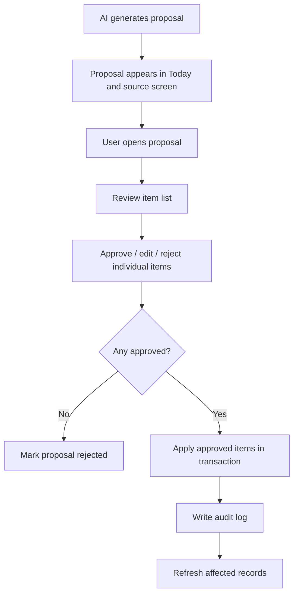

Acceptance criteria:

- AI proposals can contain multiple items.
- User can approve all, approve selected, edit selected, or reject all.
- Failed application does not partially corrupt state.
- Each item has rationale and confidence.

### 11.6 Follow-up tasks and reminders

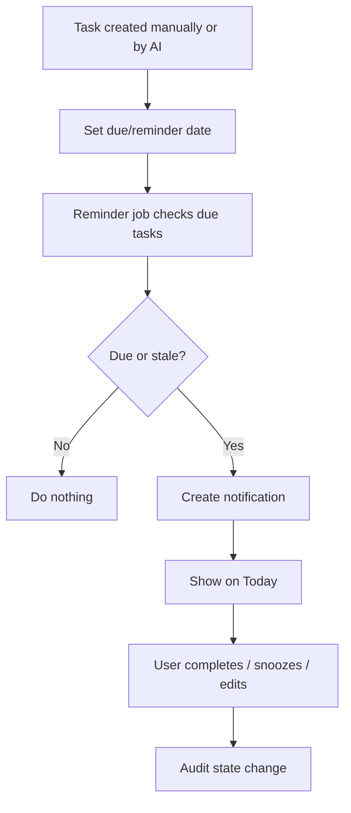

Acceptance criteria:

- Follow-ups can be created manually.
- AI can propose follow-ups.
- Tasks can be snoozed/done/cancelled.
- Why-now rationale is visible.
- Today screen shows due and overdue tasks.

### 11.7 Commitment ledger

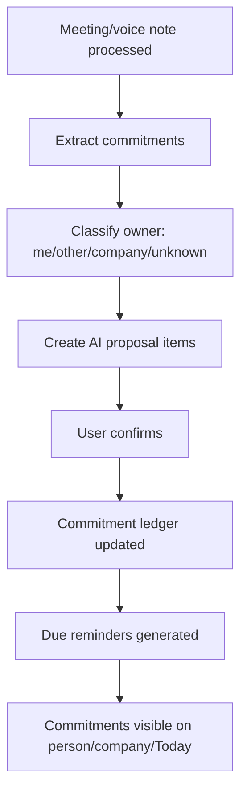

Acceptance criteria:

- Commitments are distinct from generic tasks.
- Commitments can be owned by the user or another person.
- Commitments can create follow-up tasks.
- Overdue commitments appear on Today.

### 11.8 Relationship brokerage engine

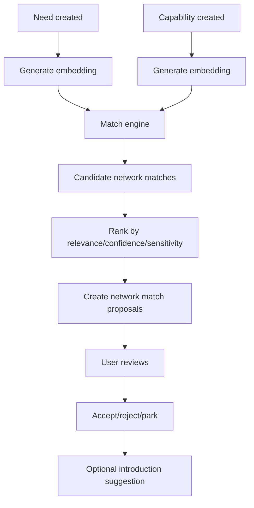

Acceptance criteria:

- Needs and capabilities are first-class records.
- Match suggestions include rationale.
- Suggestions are not automatically acted upon.
- User can accept, reject, or park.

### 11.9 Why-now engine

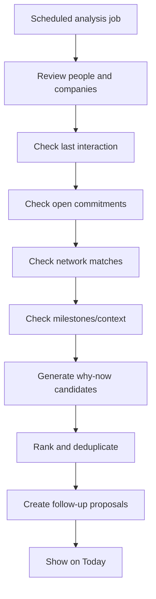

Acceptance criteria:

- Follow-up suggestions include reason categories.
- Stale relationships can trigger suggestions.
- Open commitments can trigger suggestions.
- Network match relevance can trigger suggestions.
- User can snooze or dismiss suggestions.

### 11.10 Meeting preparation briefs

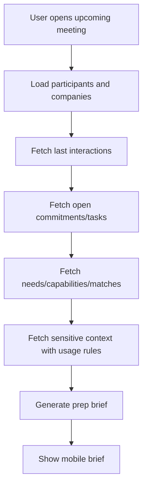

Brief must include:

- participants;
- last interactions;
- open commitments;
- likely priorities;
- known needs;
- relevant capabilities/cases;
- suggested talking points;
- topics to avoid;
- possible introductions;
- suggested next action.

### 11.11 LinkedIn manual enrichment

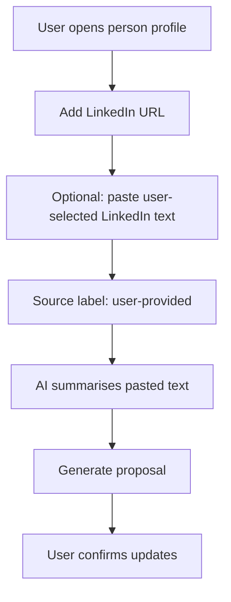

Hard constraints:

- Do not scrape LinkedIn.
- Do not automate profile visits.
- Do not use headless browsers.
- Do not monitor LinkedIn activity automatically.
- Do not build browser extensions for LinkedIn scraping.
- Do not store LinkedIn content unless manually provided by the user or imported through an allowed export/API route.

### 11.12 Search and semantic memory

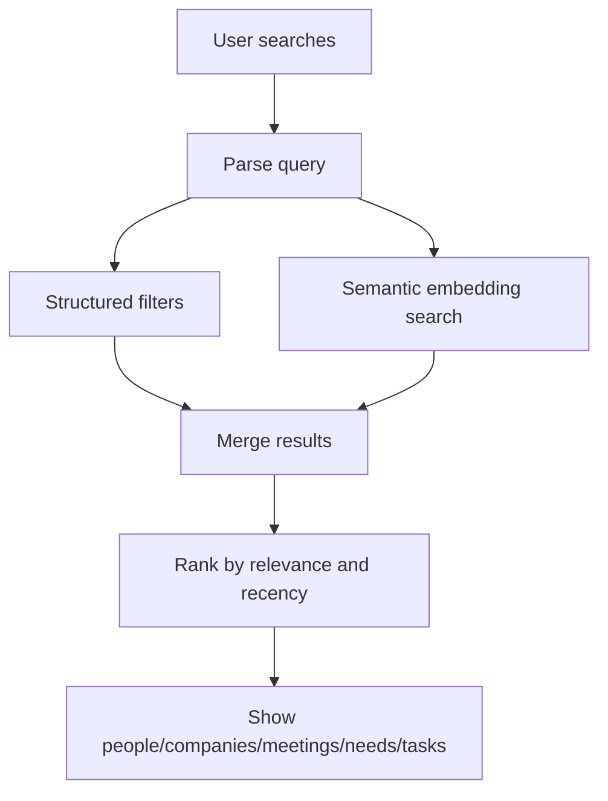

Acceptance criteria:

- Search works across people, companies, meetings, notes, needs, capabilities, tasks, commitments.
- Semantic search supports natural language queries.
- Results show source context.

### 11.13 Microsoft integration readiness

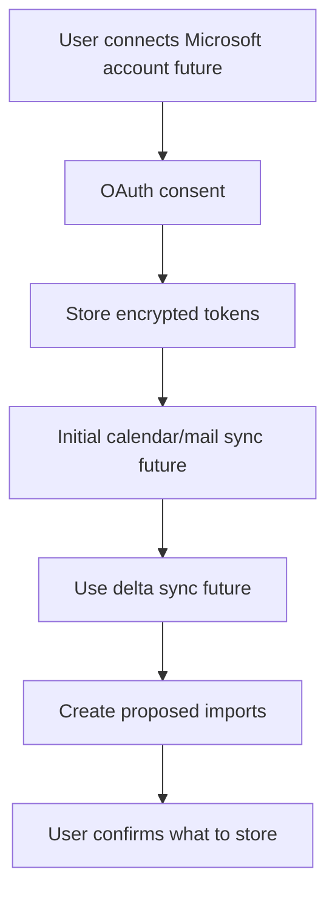

V1 requirement:

- Create integration abstraction and data model.
- Do not require Graph integration for V1.
- Do not ingest all email by default.
- Future ingestion must be selective and consent-based.

### 11.14 Sensitive-context handling

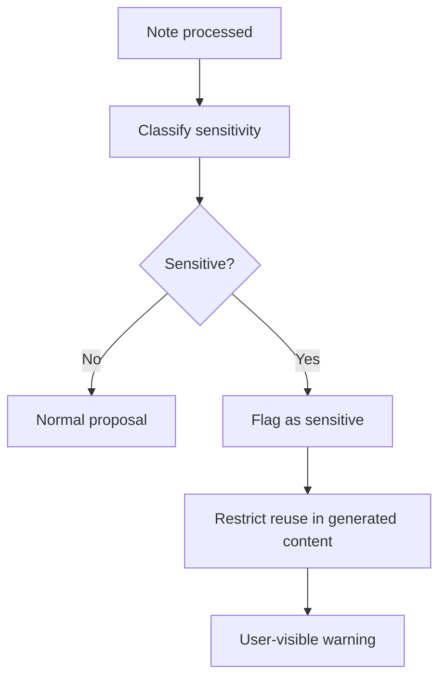

Acceptance criteria:

- Sensitive notes are marked.
- Do-not-use-in-outreach information is excluded from draft messages unless explicitly included by user.
- Personal milestones are not treated as verified facts unless user confirms.

---

## 12. AI Agent Architecture

### 12.1 AI provider abstraction

```typescript
export interface AIProvider {
  generateStructured<TInput, TOutput>(input: {
    task: string;
    schemaName: string;
    schema: unknown;
    payload: TInput;
    tenantId: string;
    userId: string;
  }): Promise<{
    output: TOutput;
    model: string;
    usage?: Record<string, unknown>;
    rawResponseId?: string;
  }>;
}
```

### 12.2 Speech-to-text provider abstraction

```typescript
export interface SpeechToTextProvider {
  transcribe(input: {
    audioBuffer: Buffer;
    mimeType: string;
    languageHint?: string;
    tenantId: string;
    userId: string;
    sourceContext?: {
      type: "GENERAL" | "PERSON" | "COMPANY" | "MEETING" | "TASK";
      id?: string;
    };
  }): Promise<{
    transcriptText: string;
    detectedLanguage?: string;
    durationSeconds?: number;
    confidence?: number;
    speakerSegments?: Array<{
      speaker: string;
      startSeconds: number;
      endSeconds: number;
      text: string;
    }>;
    provider: "OPENAI" | "AZURE" | "OTHER";
    providerMetadata?: Record<string, unknown>;
  }>;
}
```

### 12.3 Required agents

#### MeetingExtractionAgent

Input:

- raw meeting note;
- known people/companies;
- optional meeting metadata.

Output:

- summary;
- participants;
- proposed person/company updates;
- needs;
- capabilities;
- commitments;
- follow-up tasks;
- milestones;
- sensitivity flags;
- clarifying questions.

#### VoiceUpdateAgent

Input:

- voice transcript;
- source context;
- known people/companies;
- optional recent interactions.

Output:

- same structure as MeetingExtractionAgent, but adapted for quick spoken updates.

#### EntityResolutionAgent

Input:

- extracted names;
- candidate records;
- source context.

Output:

- resolved entity or clarification question.

Rule:

- If confidence is below threshold, ask user; do not guess.

#### NetworkBrokerageAgent

Input:

- open needs;
- capabilities;
- people/companies;
- relationship graph;
- sensitivity constraints.

Output:

- match suggestions;
- rationale;
- suggested action;
- introduction recommendation if relevant.

#### FollowUpReasoningAgent

Input:

- people/companies;
- last interactions;
- commitments;
- milestones;
- network matches;
- user objectives.

Output:

- why-now follow-up suggestions.

#### MeetingPrepAgent

Input:

- upcoming meeting or selected people/company;
- related records;
- sensitive context rules.

Output:

- mobile meeting prep brief.

#### SensitiveContextClassifier

Input:

- note/transcript/proposed data.

Output:

- sensitivity flags and reuse restrictions.

---

## 13. AI JSON Contracts

### 13.1 Voice and meeting extraction schema

All output must be validated against a Zod schema equivalent to this JSON contract.

```json
{
  "summary": "string",
  "detected_language": "en|da|de|other",
  "mentioned_people": [
    {
      "name": "string",
      "possible_existing_person_ids": ["string"],
      "confidence": 0.0,
      "reasoning_summary": "string"
    }
  ],
  "mentioned_companies": [
    {
      "name": "string",
      "possible_existing_company_ids": ["string"],
      "confidence": 0.0,
      "reasoning_summary": "string"
    }
  ],
  "proposed_updates": [
    {
      "type": "CREATE_PERSON | UPDATE_PERSON | CREATE_COMPANY | UPDATE_COMPANY | CREATE_MEETING | ADD_MEETING_NOTE | CREATE_TASK | CREATE_NEED | CREATE_CAPABILITY | CREATE_COMMITMENT | CREATE_NETWORK_MATCH | CREATE_INTRODUCTION_SUGGESTION | ADD_MILESTONE | ADD_SENSITIVE_NOTE",
      "target_entity_type": "PERSON | COMPANY | MEETING | TASK | NEED | CAPABILITY | COMMITMENT | NETWORK_MATCH | INTRODUCTION | MILESTONE | NOTE",
      "target_entity_id": "string|null",
      "confidence": 0.0,
      "proposed_change": {},
      "user_visible_explanation": "string",
      "requires_confirmation": true
    }
  ],
  "clarifying_questions": [
    {
      "question": "string",
      "reason": "string",
      "blocking": true
    }
  ],
  "sensitivity_flags": [
    {
      "type": "PERSONAL | COMMERCIAL | LEGAL | HEALTH | CONFIDENTIAL | DO_NOT_USE_IN_OUTREACH | UNKNOWN",
      "reason": "string",
      "recommended_handling": "string"
    }
  ]
}
```

### 13.2 Network match schema

```json
{
  "matches": [
    {
      "need_id": "string",
      "capability_id": "string|null",
      "suggested_person_id": "string|null",
      "suggested_company_id": "string|null",
      "match_type": "PERSON_CAN_HELP | COMPANY_CAN_HELP | INTRODUCTION | INSIGHT_TO_SHARE | CASE_TO_SHARE",
      "confidence": 0.0,
      "rationale": "string",
      "suggested_action": "string",
      "sensitivity_warnings": ["string"]
    }
  ]
}
```

### 13.3 Meeting prep schema

```json
{
  "brief_title": "string",
  "participants": [
    {
      "person_id": "string|null",
      "name": "string",
      "role": "string|null",
      "company": "string|null",
      "relationship_context": "string|null"
    }
  ],
  "last_interactions": ["string"],
  "open_commitments": ["string"],
  "known_needs": ["string"],
  "relevant_capabilities_or_cases": ["string"],
  "suggested_talking_points": ["string"],
  "topics_to_avoid_or_handle_carefully": ["string"],
  "possible_introductions": ["string"],
  "recommended_next_action": "string"
}
```

### 13.4 Why-now schema

```json
{
  "suggestions": [
    {
      "person_id": "string|null",
      "company_id": "string|null",
      "suggested_action": "string",
      "reason_category": "STALE_RELATIONSHIP | OPEN_COMMITMENT | NETWORK_MATCH | MILESTONE | UPCOMING_MEETING | STRATEGIC_OBJECTIVE | OTHER",
      "why_now": "string",
      "confidence": 0.0,
      "suggested_due_date": "ISO_DATE|null",
      "source_refs": [
        {
          "source_type": "string",
          "source_id": "string"
        }
      ]
    }
  ]
}
```

---

## 14. Provider Interfaces

### 14.1 Storage provider

```typescript
export interface StorageProvider {
  putObject(input: {
    key: string;
    body: Buffer | Uint8Array;
    contentType: string;
    tenantId: string;
  }): Promise<{ key: string; url?: string }>;

  getObject(input: { key: string; tenantId: string }): Promise<Buffer>;

  deleteObject(input: { key: string; tenantId: string }): Promise<void>;

  createSignedUrl(input: {
    key: string;
    tenantId: string;
    expiresInSeconds: number;
  }): Promise<string>;
}
```

### 14.2 Job provider

```typescript
export interface JobProvider {
  enqueue<TPayload>(input: {
    name: string;
    payload: TPayload;
    runAt?: Date;
    tenantId: string;
  }): Promise<{ jobId: string }>;
}
```

### 14.3 Notification provider

```typescript
export interface NotificationProvider {
  send(input: {
    tenantId: string;
    userId: string;
    channel: "IN_APP" | "EMAIL";
    title: string;
    body?: string;
    actionUrl?: string;
  }): Promise<void>;
}
```

### 14.4 Billing provider

```typescript
export interface BillingProvider {
  createCustomer(input: { tenantId: string; email: string; name?: string }): Promise<{ customerId: string }>;
  createCheckoutSession(input: { tenantId: string; customerId: string; priceId: string }): Promise<{ url: string }>;
  handleWebhook(input: { rawBody: string | Buffer; signature: string }): Promise<void>;
}
```

### 14.5 Microsoft Graph provider

```typescript
export interface MicrosoftGraphProvider {
  getCalendarEvents(input: {
    accessToken: string;
    from: Date;
    to: Date;
  }): Promise<Array<unknown>>;

  getMailThreads(input: {
    accessToken: string;
    query?: string;
    limit: number;
  }): Promise<Array<unknown>>;

  getDeltaChanges(input: {
    accessToken: string;
    deltaToken?: string;
  }): Promise<{ changes: Array<unknown>; nextDeltaToken?: string }>;
}
```

---

## 15. API and Server Action Contract

Codex may implement with Next.js Server Actions and/or API routes. The contract below must be preserved.

### 15.1 People

- `createPerson(input)`
- `updatePerson(id, patch)`
- `archivePerson(id)`
- `getPerson(id)`
- `searchPeople(query, filters)`
- `linkPersonToCompany(personId, companyId, roleData)`

### 15.2 Companies

- `createCompany(input)`
- `updateCompany(id, patch)`
- `archiveCompany(id)`
- `getCompany(id)`
- `searchCompanies(query, filters)`

### 15.3 Meetings

- `createMeeting(input)`
- `pasteMeetingNotes(meetingId, rawNotes)`
- `runMeetingExtraction(meetingId)`
- `getMeeting(id)`
- `listMeetings(filters)`

### 15.4 Voice

- `createVoiceNote(context)`
- `uploadVoiceAudio(voiceNoteId, audio)`
- `transcribeVoiceNote(voiceNoteId)`
- `updateVoiceTranscript(voiceNoteId, transcriptText)`
- `structureVoiceNote(voiceNoteId)`
- `rejectVoiceNoteProposal(voiceNoteId)`

### 15.5 AI proposals

- `getProposal(id)`
- `listPendingProposals(filters)`
- `approveProposalItems(proposalId, itemIds)`
- `editProposalItem(itemId, patch)`
- `rejectProposalItems(proposalId, itemIds)`
- `applyApprovedProposalItems(proposalId)`

### 15.6 Tasks and commitments

- `createFollowUpTask(input)`
- `updateFollowUpTask(id, patch)`
- `completeFollowUpTask(id)`
- `snoozeFollowUpTask(id, newReminderAt)`
- `createCommitment(input)`
- `updateCommitment(id, patch)`
- `completeCommitment(id)`

### 15.7 Brokerage

- `createNeed(input)`
- `createCapability(input)`
- `runNetworkMatchForNeed(needId)`
- `listNetworkMatches(filters)`
- `acceptNetworkMatch(id)`
- `rejectNetworkMatch(id)`
- `parkNetworkMatch(id)`
- `createIntroductionSuggestion(input)`
- `updateIntroductionStatus(id, status)`

### 15.8 Search

- `globalSearch(query, filters)`
- `semanticSearch(query, filters)`

### 15.9 Admin/privacy

- `exportTenantData()`
- `requestDeletion(entityType, entityId)`
- `listAuditLogs(filters)`
- `updateTenantSettings(patch)`

---

## 16. Security, Privacy, and Governance

### 16.1 Security baseline

Implement baseline controls aligned with OWASP web application practices:

- secure authentication;
- session protection;
- CSRF protection where relevant;
- secure cookies;
- server-side authorization checks;
- input validation;
- output escaping;
- rate limiting for sensitive endpoints;
- upload validation;
- file type restrictions;
- audit logging;
- encrypted secrets;
- no secrets in client bundles;
- dependency vulnerability checks;
- tenant isolation tests.

### 16.2 RBAC

Roles:

- `OWNER`: all permissions, billing, delete/export.
- `ADMIN`: manage workspace and records, no billing ownership unless granted.
- `MEMBER`: create/edit records, process notes, approve own AI proposals.
- `VIEWER`: read-only.

V1 may only have one user, but RBAC must be implemented because V2 will require it.

### 16.3 Tenant isolation

Every query for tenant-owned data must be scoped by tenant ID. Never trust tenant ID from the client without verifying membership.

Required tests:

- user from tenant A cannot read tenant B person;
- user from tenant A cannot mutate tenant B meeting;
- user from tenant A cannot approve tenant B AI proposal;
- search results never leak cross-tenant data.

### 16.4 Privacy and GDPR-oriented principles

Implement:

- data minimisation;
- source visibility;
- export capability;
- deletion/archive capability;
- raw audio deletion by default;
- purpose-specific storage;
- auditability;
- clear retention rules;
- future consent tracking for email/calendar integrations.

### 16.5 Voice privacy

Default:

- raw audio deleted after successful transcription;
- transcript retained;
- structured updates retained only after confirmation;
- rejected proposals may be retained for 30 days or until user deletion;
- user can manually delete transcript/voice note.

### 16.6 Sensitive information handling

Sensitive flags must not equal verified truth. They are handling instructions.

Examples:

- `PERSONAL`
- `SENSITIVE_BUSINESS`
- `CONFIDENTIAL`
- `DO_NOT_USE_IN_OUTREACH`
- `DO_NOT_SHARE`

Generated messages and meeting briefs must respect these flags.

---

## 17. LinkedIn Compliance Strategy

### 17.1 V1 allowed

Allowed:

- store LinkedIn profile URL;
- store Sales Navigator URL if user manually provides it;
- allow user to paste selected LinkedIn profile/update text;
- summarise user-provided text;
- mark source as `LINKEDIN_USER_PROVIDED`;
- create manual “review LinkedIn before meeting” tasks;
- store last manual review date.

### 17.2 V1 prohibited

Do not build:

- automated LinkedIn browsing;
- LinkedIn scraping;
- headless browser LinkedIn agents;
- background LinkedIn profile monitoring;
- automatic LinkedIn connection/message/comment/like activity;
- browser extension that scrapes LinkedIn;
- storage of LinkedIn content acquired outside allowed user-provided/export/API routes;
- “agent navigates as the user” LinkedIn workflows.

### 17.3 Future possible compliant routes

Future options only after legal/product review:

- LinkedIn official partner APIs if approved;
- user-uploaded LinkedIn data export;
- Sales Navigator CRM integration if eligible;
- manual browser bookmarklet that captures only user-selected text, subject to legal review.

---

## 18. Microsoft Integration Readiness

### 18.1 V1 requirement

Do not build full Microsoft integration unless explicitly requested after foundation is complete. Build the architecture so it can be added later.

### 18.2 Future integration sequence

1. Microsoft OAuth connection.
2. Calendar read for upcoming meetings.
3. User-selected calendar event import.
4. Selective email-thread import.
5. Delta sync for changes.
6. User-controlled AI extraction.
7. Never ingest all emails without explicit consent and narrow configuration.

### 18.3 Permission principles

- Use least privilege.
- Ask only for scopes needed.
- Encrypt tokens.
- Allow disconnect/revoke.
- Log sync actions.
- Prefer user-selected import over bulk ingestion.

---

## 19. Migration-Ready Requirements

### 19.1 Required portability capabilities

The application must:

- run locally via Docker Compose;
- produce a production Docker image;
- run as a Node.js server outside Vercel;
- connect to PostgreSQL using `DATABASE_URL`;
- run migrations from zero using Prisma;
- avoid direct dependencies on Vercel APIs in business logic;
- avoid Neon-only features as product dependencies;
- abstract storage, jobs, AI, STT, billing, notifications, telemetry;
- document Azure migration steps;
- include an `.env.example` with all required variables;
- include health check endpoint;
- include readiness endpoint if needed for containers.

### 19.2 Local Docker Compose

Must include:

- app container;
- PostgreSQL container;
- optional local object storage emulator if feasible;
- migration command;
- seed command.

### 19.3 Dockerfile

Must:

- build production Next.js app;
- run in non-root user if feasible;
- expose app port;
- support environment variables;
- not bake secrets into image.

### 19.4 Azure migration path

Document the following:

1. Create Azure Container Registry.
2. Build and push Docker image.
3. Provision Azure Container Apps.
4. Provision Azure Database for PostgreSQL Flexible Server.
5. Provision Azure Blob Storage.
6. Provision Key Vault.
7. Set environment variables/secrets.
8. Export Neon/Postgres database with `pg_dump` for small V1 datasets or use staged migration for larger deployments.
9. Restore into Azure PostgreSQL.
10. Run migrations/checks.
11. Deploy app.
12. Run smoke tests.
13. Switch DNS.
14. Monitor logs/errors.

### 19.5 Migration acceptance test

Before V1 is considered complete, prove:

- app runs locally with Docker Compose;
- app can run against a fresh PostgreSQL instance;
- migrations can build schema from zero;
- seed demo data works;
- production Docker image boots;
- no critical feature requires Vercel runtime APIs;
- no critical feature requires Neon-only behaviour.

---

## 20. CI/CD and Environments

### 20.1 Environments

- `local`
- `preview`
- `staging`
- `production`

### 20.2 Git workflow

- Feature branch.
- Pull request.
- CI checks.
- Preview deployment.
- Review.
- Merge to main.
- Production deployment.

### 20.3 CI checks

Required:

- install dependencies;
- typecheck;
- lint;
- format check;
- unit tests;
- integration tests;
- tenant isolation tests;
- RBAC tests;
- Prisma schema validation;
- migration validation;
- production build;
- Docker build check;
- Playwright smoke tests where feasible.

### 20.4 Database migration rules

- Use Prisma migrations.
- Use `prisma migrate dev` locally.
- Use `prisma migrate deploy` in staging/production.
- No `db push` in production.
- Avoid destructive migrations.
- Use expand/contract for risky changes.

---

## 21. Implementation Sequence

Codex must build in this order.

### Phase 0 — Repository and tooling

Deliver:

- Next.js app;
- TypeScript;
- Tailwind;
- shadcn/ui;
- Prisma;
- Dockerfile;
- Docker Compose;
- `.env.example`;
- lint/typecheck/test scripts;
- CI workflow.

Acceptance:

- app boots locally;
- Docker Compose boots app and PostgreSQL;
- CI runs.

### Phase 1 — Database, tenancy, auth, RBAC, audit

Deliver:

- Prisma schema core;
- migrations;
- seed data;
- authentication;
- tenant model;
- membership model;
- RBAC checks;
- audit log service.

Acceptance:

- user can log in;
- user has tenant;
- tenant isolation tests pass;
- audit log works.

### Phase 2 — Mobile shell and navigation

Deliver:

- mobile-first layout;
- Today/Capture/People/Opportunities/Search nav;
- desktop fallback layout;
- loading/empty/error states.

Acceptance:

- works on mobile viewport;
- all primary routes exist;
- navigation is usable by thumb.

### Phase 3 — People and companies

Deliver:

- CRUD;
- link people/companies;
- relationship status/temperature;
- LinkedIn URL field;
- search/list/detail.

Acceptance:

- create/edit/archive person/company;
- link role;
- audit logs.

### Phase 4 — Meeting notes and AI proposal foundation

Deliver:

- create meeting;
- paste notes;
- AI proposal model/UI;
- proposal approval/rejection;
- structured extraction schema.

Acceptance:

- notes produce proposal;
- user approves selected items;
- no mutation before approval.

### Phase 5 — Tasks and commitment ledger

Deliver:

- follow-up tasks;
- commitment records;
- Today reminders;
- why-now rationale field.

Acceptance:

- tasks visible on Today;
- commitments are separate from tasks;
- overdue items appear.

### Phase 6 — Voice capture / speak-to-update

Deliver:

- mobile voice recorder;
- upload/transcribe with OpenAI provider;
- editable transcript;
- structured proposal;
- approval workflow;
- raw audio deletion policy.

Acceptance:

- user can dictate update;
- transcript appears;
- proposed updates generated;
- approved updates applied.

### Phase 7 — Needs, capabilities, brokerage

Deliver:

- Need records;
- Capability records;
- semantic embeddings;
- match suggestions;
- introduction suggestions.

Acceptance:

- need can match capability/person/company;
- rationale visible;
- user can accept/reject/park.

### Phase 8 — Why-now and meeting prep

Deliver:

- why-now job;
- meeting prep brief;
- sensitive context handling.

Acceptance:

- Today shows reasoned follow-up suggestions;
- meeting prep brief includes relationship context.

### Phase 9 — Search and semantic memory

Deliver:

- structured + semantic search;
- embedding jobs;
- result ranking and source context.

Acceptance:

- natural language search returns relevant records.

### Phase 10 — LinkedIn manual enrichment

Deliver:

- LinkedIn URL;
- manual pasted context;
- summarisation proposal;
- compliance constraints documented in UI/code comments.

Acceptance:

- user can paste selected text;
- AI proposes updates;
- no automation/scraping code exists.

### Phase 11 — Billing/admin/privacy/future integrations

Deliver:

- Stripe foundation;
- settings;
- export/delete;
- Microsoft integration data model and placeholder UI;
- provider interfaces.

Acceptance:

- billing status exists;
- export/delete path exists;
- Microsoft integration not active unless implemented intentionally.

### Phase 12 — QA, hardening, demo data

Deliver:

- Playwright e2e tests;
- demo workspace;
- AI fixtures/evals;
- migration dry run;
- security review checklist;
- README.

Acceptance:

- all critical flows pass;
- app can be reviewed by product owner.

---

## 22. Demo Data and Test Fixtures

### 22.1 Demo dataset

Create seeded demo data with:

- 8 companies;
- 25 people;
- 12 meetings;
- 20 follow-up tasks;
- 15 commitments;
- 20 needs;
- 20 capabilities;
- 10 network matches;
- 5 introduction suggestions;
- 5 voice notes with transcripts;
- 5 AI proposals pending review.

Industries should include:

- industrial manufacturing;
- energy;
- software;
- consulting;
- logistics;
- public sector.

### 22.2 Sample voice transcript

```text
I just met Anna from Siemens. She recently took over process ownership for their PLM transformation. She is struggling with governance between engineering and IT. I should follow up in two weeks and maybe connect her with Michael, who has the Signavio process governance experience from the automotive project. Also note that the budget discussion is sensitive and should not be mentioned in outreach.
```

Expected AI proposals:

- update Anna role/company;
- create need: PLM process ownership governance;
- create capability reference to Michael/Signavio process governance;
- create follow-up task in two weeks;
- create network match/intro suggestion;
- create sensitive note: budget discussion confidential/do-not-use-in-outreach.

### 22.3 Sample meeting note

```text
Meeting with Peter Hansen from Vestas and Laura from internal team. Topic: MBSE training and SE certification readiness. Peter mentioned the engineering teams need more practical training examples, not just theory. He asked whether we can share a sample agenda for a 3-day training. I promised to send an outline next week. Potential relevance: connect with Thomas, who has delivered SE-CERT preparation before.
```

Expected outputs:

- person/company link;
- need: practical MBSE training examples;
- commitment: send sample agenda next week;
- capability: Thomas SE-CERT prep experience;
- network match/intro suggestion;
- follow-up task.

---

## 23. Testing Strategy

### 23.1 Unit tests

Test:

- validation schemas;
- entity resolution utilities;
- date parsing;
- tenant guard helpers;
- RBAC rules;
- AI schema parsing;
- provider adapter mocks.

### 23.2 Integration tests

Test:

- create person/company;
- link person to company;
- meeting note → AI proposal → approval → records updated;
- voice note → transcript → proposal → approval;
- need/capability → match suggestion;
- task reminders;
- export/delete.

### 23.3 E2E tests

Use Playwright for:

- login/demo mode;
- create person;
- paste meeting note;
- approve AI proposal;
- record voice note mock/transcript path;
- create follow-up;
- view Today;
- search.

### 23.4 Tenant isolation tests

Mandatory. Include malicious/cross-tenant attempts.

### 23.5 AI evaluation tests

Use fixtures to verify:

- extraction returns valid schema;
- commitments are detected;
- sensitive context is flagged;
- entity ambiguity produces clarification;
- no direct mutation occurs without confirmation.

---

## 24. Performance Requirements

Mobile performance targets:

- initial page interactive target: under 3 seconds on normal 4G for common screens where feasible;
- common navigation transitions: under 500 ms perceived latency where cached;
- voice upload progress visible immediately;
- long AI processing must run async with visible status;
- Today screen must not block on AI jobs;
- search should return first results quickly, with semantic results allowed to stream/load after structured results if needed.

---

## 25. Environment Variables

Create `.env.example` with at least:

```bash
# App
APP_URL=
NODE_ENV=

# Auth
AUTH_SECRET=
AUTH_MICROSOFT_ENTRA_ID_ID=
AUTH_MICROSOFT_ENTRA_ID_SECRET=
AUTH_MICROSOFT_ENTRA_ID_TENANT_ID=

# Database
DATABASE_URL=

# OpenAI
OPENAI_API_KEY=
OPENAI_TRANSCRIPTION_MODEL=gpt-4o-mini-transcribe
OPENAI_STRUCTURING_MODEL=
OPENAI_EMBEDDING_MODEL=

# Storage
STORAGE_PROVIDER=s3
S3_ENDPOINT=
S3_REGION=
S3_BUCKET=
S3_ACCESS_KEY_ID=
S3_SECRET_ACCESS_KEY=

# Jobs
JOB_PROVIDER=inngest
INNGEST_EVENT_KEY=
INNGEST_SIGNING_KEY=

# Billing
STRIPE_SECRET_KEY=
STRIPE_WEBHOOK_SECRET=
STRIPE_PRICE_ID_PRO=

# Telemetry
SENTRY_DSN=

# Feature flags
FEATURE_MICROSOFT_GRAPH=false
FEATURE_LINKEDIN_MANUAL_ENRICHMENT=true
FEATURE_VOICE_CAPTURE=true
FEATURE_BILLING=false
```

---

## 26. Error Handling and Empty States

Implement user-friendly states for:

- no people yet;
- no companies yet;
- no meetings yet;
- no tasks due;
- no search results;
- failed transcription;
- failed AI structuring;
- ambiguous entity resolution;
- duplicate person/company;
- billing inactive;
- Microsoft integration disconnected;
- AI provider unavailable;
- upload too large;
- unsupported audio format.

Failures must not corrupt data.

---

## 27. Definition of Done

The V1 application is not done until all criteria below are met.

### 27.1 Product done

- Mobile-first app works.
- Today/Capture/People/Opportunities/Search exist.
- People and companies work.
- Meetings and notes work.
- Voice capture works.
- AI proposal review works.
- Follow-up tasks work.
- Commitment ledger works.
- Needs/capabilities work.
- Network matches work.
- Why-now recommendations work.
- Meeting prep briefs work.
- Manual LinkedIn enrichment works without scraping.
- Search works.
- Demo data exists.

### 27.2 Architecture done

- Modular monolith structure implemented.
- Provider adapters implemented.
- Dockerfile works.
- Docker Compose works.
- App runs outside Vercel.
- PostgreSQL migrations work from zero.
- No business logic depends on Vercel or Neon.
- Azure migration path documented.

### 27.3 Security done

- Auth works.
- RBAC works.
- Tenant isolation tests pass.
- Audit logs exist.
- Sensitive actions logged.
- Raw audio deletion policy implemented.
- Secrets are not exposed to client.

### 27.4 QA done

- Typecheck passes.
- Lint passes.
- Unit tests pass.
- Integration tests pass.
- Critical e2e tests pass.
- AI schema validation tests pass.
- Demo workspace can be reset/seeded.

---

## 28. Non-Negotiable “Do Not Build” List

Do not build:

1. LinkedIn scraping.
2. LinkedIn headless browser automation.
3. LinkedIn background monitoring.
4. Automated LinkedIn messaging.
5. Fully autonomous outreach.
6. Record mutation without user approval.
7. Cross-tenant search.
8. Direct provider SDK calls from UI components.
9. Business logic inside provider adapters.
10. Production-only dependency on Vercel runtime.
11. Production-only dependency on Neon-specific features.
12. Bulk email ingestion without explicit consent.
13. Long-running AI work inside blocking HTTP request handlers.
14. Indefinite raw audio storage by default.
15. Sensitive personal inferences presented as verified facts.

---

## 29. Developer Documentation Required

Codex must create or update:

- `README.md`
- `docs/architecture.md`
- `docs/data-model.md`
- `docs/deployment.md`
- `docs/azure-migration.md`
- `docs/security.md`
- `docs/ai-contracts.md`
- `docs/linkedin-compliance.md`
- `docs/testing.md`

Each document must be concise but sufficient for a future developer to understand and operate the system.

---

## 30. Recommended Build Command Checklist

The repository should support commands similar to:

```bash
pnpm install
pnpm dev
pnpm build
pnpm start
pnpm lint
pnpm typecheck
pnpm test
pnpm test:e2e
pnpm prisma:migrate
pnpm prisma:deploy
pnpm prisma:seed
docker compose up --build
```

---

## 31. External Technical Reference Notes

These references are provided for implementation orientation. Do not build external-source-dependent logic unless the relevant provider is abstracted.

- Next.js can be deployed as a Node.js server, Docker container, static export, or platform-adapted deployment: https://nextjs.org/docs/app/getting-started/deploying
- Next.js self-hosting guide: https://nextjs.org/docs/app/guides/self-hosting
- Azure Container Apps runs containerized applications without requiring orchestration management: https://learn.microsoft.com/en-us/azure/container-apps/
- Prisma production migrations use `prisma migrate deploy`: https://www.prisma.io/docs/cli/migrate/deploy
- Auth.js deployment requires `AUTH_SECRET`: https://authjs.dev/getting-started/deployment
- OpenAI speech-to-text supports transcription models such as `gpt-4o-mini-transcribe`, `gpt-4o-transcribe`, and `gpt-4o-transcribe-diarize`: https://developers.openai.com/api/docs/guides/speech-to-text
- OpenAI structured outputs can enforce JSON schema adherence: https://developers.openai.com/api/docs/guides/structured-outputs
- Microsoft Graph supports Outlook mail/calendar/contact access: https://learn.microsoft.com/en-us/graph/api/resources/mail-api-overview
- Microsoft Graph delta query supports change tracking: https://learn.microsoft.com/en-us/graph/delta-query-overview
- OWASP ASVS: https://owasp.org/www-project-application-security-verification-standard/
- GDPR principles overview: https://commission.europa.eu/law/law-topic/data-protection/rules-business-and-organisations/principles-gdpr_en
- LinkedIn prohibited software/extensions: https://www.linkedin.com/help/linkedin/answer/a1341387/prohibited-software-and-extensions
- LinkedIn API terms: https://www.linkedin.com/legal/l/api-terms-of-use

---

## 32. Final Codex Instruction

Build the V1 application according to this document.

Prioritise foundation quality over superficial feature breadth. Do not skip tenant isolation, provider abstraction, audit logs, AI confirmation flows, Docker portability, or mobile-first UX. The product should be review-ready, migration-ready, and safe to extend into a commercial SaaS product.

When a product detail is ambiguous, choose the option that best supports:

1. mobile-first consultant workflow;
2. trust and user confirmation;
3. migration readiness;
4. clean modular architecture;
5. future SaaS scalability;
6. legal/compliance safety.

